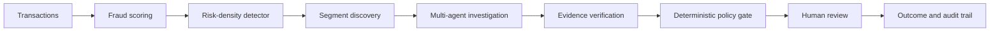

# Multi-Agentic AI Fraud Spike Detector

A fraud-operations command center that detects unusual increases in **fraud risk**, investigates them with AI agents, and keeps a human analyst in control of every
response.

The system focuses on **risk density** instead of transaction volume. This matters
because a busy shopping day and a fraud attack can have similar traffic levels,
but very different fraud rates.

## What the project does

- Scores transactions with a calibrated fraud model.
- Detects fraud spikes without using volume as a trigger.
- Finds the customer or transaction segments driving each spike.
- Runs an evidence-based, multi-agent investigation.
- Checks every recommendation with deterministic safety rules.
- Requires human approval before an action is finalized.
- Records decisions, outcomes, rewards, and audit history.
- Shows live operations, models, incidents, and reports in a web dashboard.

## System architecture

1. Transactions arrive through the API or Redpanda.
2. The fraud model assigns a calibrated risk score.
3. The spike detector watches the fraud-risk density over time.
4. A deterministic segment search identifies what is driving the spike.
5. Investigation agents collect evidence and explain likely causes.
6. A verification agent rejects unsupported claims.
7. The policy engine checks permissions, evidence quality, and safety rules.
8. A human analyst approves, modifies, rejects, or escalates the recommendation.
9. The system stores the decision and publishes outcomes through a durable outbox.



## Quick start

### 1. Install the application

Run these commands from the project root in PowerShell:

```powershell
python -m venv .venv
.\.venv\Scripts\Activate.ps1
python -m pip install --upgrade pip
pip install -r requirements/all.txt
```

### 2. Configure the environment

```powershell
Copy-Item .env.example .env
```

Open `.env` and replace the values in the **REQUIRED** section. Optional
integrations such as Gemini and LangSmith can remain blank.

### 3. Start the infrastructure

Make sure Docker Desktop is running, then execute:

```powershell
docker compose up -d
docker compose ps
```

This starts PostgreSQL, Redis, Redpanda, MLflow, Prometheus, and Grafana.

### 4. Prepare the database

```powershell
python -m alembic -c backend\alembic.ini upgrade head
python scripts\seed_database.py
```

### 5. Start the API and dashboard

```powershell
python scripts\run_api.py --port 8000
```

On Windows, use `scripts/run_api.py` instead of starting Uvicorn directly. The
script installs the event loop required by psycopg.

### 6. Stream sample transactions

Open another PowerShell terminal, activate the virtual environment, and run:

```powershell
python scripts\stream_transactions.py --split validation --speed 300
```

## Service URLs

| Service | URL |
|---|---|
| Command center | http://localhost:8000/ |
| API documentation | http://localhost:8000/docs |
| Grafana | http://localhost:3000/ |
| MLflow | http://localhost:5000/ |
| Prometheus | http://localhost:9090/ |

## Common startup problem

If you see `outbox_cycle_failed` with `WinError 1225`, PostgreSQL is not
accepting connections. Start Docker Desktop and run:

```powershell
docker compose up -d
docker compose ps
```

The outbox does not delete pending events. It retries with a capped backoff and
logs `outbox_cycle_recovered` when PostgreSQL becomes available again.

## Why risk density matters

The dataset contains both fraud spikes and legitimate traffic surges:

| Traffic type | Volume compared with normal | Fraud rate |
|---|---:|---:|
| Normal traffic | About 1.0× | 1.69%–1.83% |
| Fraud spikes | 2.3×–2.9× | 13.7%–22.3% |
| Legitimate surges | 2.2×–2.6× | 0.8%–2.3% |

Fraud spikes and legitimate surges can have almost the same volume. A
volume-based alert would therefore generate false alarms during festivals,
flash sales, or salary days.

This detector triggers on calibrated fraud probability. Volume is shown in the
dashboard for context, but it cannot trigger an incident.

## Dashboard

The frontend uses HTML, CSS, and vanilla JavaScript. It has no build step.

| View | Purpose |
|---|---|
| Landing | Sign-in and an animated overview of the system |
| Risk Dashboard | Live scores, risk trends, incidents, exposure, alerts, and drift |
| Incidents | Searchable and filterable incident queue |
| Investigation | Agent timeline, evidence, segments, recommendations, policy checks, and human review |
| Models & Policies | Production and candidate comparison, drift, promotion checks, and rollback controls |
| Held-out Report | Displays the sealed evaluation directly from `results.json` |

The header shows the health of each dependency. Animations respect the operating system's reduced-motion preference.

## Technology stack

| Area | Technology |
|---|---|
| Frontend | HTML, CSS, vanilla JavaScript |
| API | FastAPI |
| Fraud model | XGBoost with isotonic calibration |
| Fraud-model fallbacks | Isolation Forest, then deterministic rules |
| Agent workflow | LangGraph and LangChain |
| LLM provider | Gemini with structured outputs |
| Database | PostgreSQL, SQLAlchemy, Alembic |
| Cache | Redis with an in-process LRU fallback |
| Streaming | Redpanda through the Kafka API |
| Reward model | Random Forest regressor |
| Response policy | LinUCB trained offline |
| Experiment tracking | MLflow |
| Monitoring | Prometheus and Grafana |
| Tracing | LangSmith |

## Reliability and safety

The system is designed to fail visibly and safely.

| Failure | Behavior |
|---|---|
| Primary fraud model unavailable | Uses Isolation Forest, then deterministic rules |
| Gemini unavailable | Tries lower-cost model tiers, then uses a deterministic template |
| Redis unavailable | Uses a bounded in-process cache |
| Redpanda unavailable | Keeps unpublished events in the PostgreSQL outbox |
| PostgreSQL unavailable | Reports degradation and retries database-dependent work |
| Unsupported agent claim | Rejects the claim during evidence verification |
| Unsafe recommendation | Blocks or escalates it through deterministic policy rules |
| Weak candidate policy | Keeps it in shadow mode and refuses promotion |

Important safety rules:

- Language models can recommend actions, but they cannot authorize them.
- Language models do not calculate financial impact.
- Policy promotion is admin-only and never automatic.
- Duplicate transactions and events are handled idempotently.
- Every important decision has an audit trail.
- Delivery is at least once; consumers deduplicate events using `event_id`.

All nine failure drills pass. See [Failure drills](reports/FAILURE_DRILLS.md) for details.

## Held-out evaluation

The values below come from `reports/heldout_test/results.json`. The dashboard and
README do not invent or hardcode evaluation results.

### Spike detection

| Metric | Result |
|---|---:|
| Event recall | **1.000** — 3 of 3 fraud spikes detected |
| Event precision | **1.000** |
| False alerts | **0** |
| False alerts during legitimate surges | **0** |
| Median detection delay | 30 minutes |
| P90 detection delay | 30 minutes |

### Transaction classification

| Metric | Result |
|---|---:|
| PR-AUC | 0.9485 |
| ROC-AUC | 0.9969 |
| Recall | 0.9780 |
| Precision | 0.6209 |
| F1 | 0.7596 |
| True positives | 267 |
| False positives | 163 |
| False negatives | 6 |
| True negatives | 5,564 |
| Frozen threshold | 0.3715 |

### Business result

| Metric | Result |
|---|---:|
| Fraud value captured | ₹1,153,387.28 |
| Fraud value missed | ₹18,171.85 |
| False-positive cost | ₹50,224.68 |
| Legitimate value disrupted | ₹545,282.60 |
| Analyst review cost | ₹750.00 |
| Customer friction cost | ₹6,520.00 |
| **Net risk benefit** | **₹1,095,892.60** |

Analyst review, customer friction, and delay costs are assumptions rather than
measured transaction fields. They are documented in
[Cost assumptions](reports/COST_ASSUMPTIONS.md).

### Important evaluation caveat

Held-out precision was **0.62**, below the validation target of **0.90**. Recall
increased to **0.978**. The threshold was frozen before the held-out run and was
not adjusted afterwards.

The model still ranked transactions well, with a PR-AUC of **0.9485**, but the
frozen threshold did not transfer cleanly to the harder held-out fraud patterns.
See the [full held-out report](reports/heldout_test/report.md) and
[held-out caveats](reports/heldout_test/CAVEATS.md).

## Evaluation integrity

- Held-out labels are available only through a guarded loader.
- The labels were accessed three times. Every access is recorded in the
  [access log](reports/heldout_test/ACCESS_LOG.md).
- The second and third reads fixed report-generation defects only.
- No model, threshold, detector setting, or policy changed after the first read.
- Transaction, event, and business metrics were identical across all three reads.
- Live agent-narrative metrics were marked as not measured because an LLM
  credential was unavailable at freeze time.

## Useful commands

### Offline training and evaluation

```powershell
python scripts\run_evaluation.py --check
python scripts\run_evaluation.py --phase2
python training\train_fraud_model.py
python training\train_reward_model.py
python training\train_bandit.py
python evaluation\evaluate_policy.py
python evaluation\heldout_report.py
```

The held-out evaluation is sealed. Do not rerun it casually after the project is frozen.

### Failure drills and frontend checks

```powershell
python scripts\failure_drills.py
python scripts\check_frontend.py
```

### Project validation

```powershell
python -m pytest tests -q
python -m ruff check backend training evaluation scripts tests
python -m compileall -q backend training evaluation scripts tests
docker compose config --quiet
```

## Project structure

```text
backend/app/     API, services, agents, ML, safety, database, and streaming
frontend/        Dashboard pages, styles, JavaScript, and assets
training/        Fraud, reward, and policy training scripts
evaluation/      Guarded data loading and evaluation code
monitoring/      Prometheus, Grafana, dashboards, and alerts
infrastructure/  Policy and action-effect configuration
scripts/         Setup, replay, evaluation, drills, and validation tools
tests/           Automated test suite
reports/         Evaluation, assumptions, drills, caveats, and demo guides
models/          Saved model and policy artifacts
data/            Dataset files and generated data
```

## Reports and guides

- [Evaluation protocol](reports/EVALUATION_PROTOCOL.md) — training, calibration,
  threshold selection, and freeze process.
- [Cost assumptions](reports/COST_ASSUMPTIONS.md) — measured values and business
  assumptions.
- [Held-out report](reports/heldout_test/report.md) — full sealed evaluation and
  sensitivity analysis.
- [Held-out caveats](reports/heldout_test/CAVEATS.md) — precision shortfall and
  policy-comparison limits.
- [Held-out access log](reports/heldout_test/ACCESS_LOG.md) — every access to the
  sealed labels.
- [Failure drills](reports/FAILURE_DRILLS.md) — dependency and safety failure tests.
- [Demo runbook](reports/DEMO_RUNBOOK.md) — guided product demonstration.
- [EDA findings](reports/EDA_FINDINGS.md) — why transaction volume is a poor
  fraud-spike signal.
- [Phase 2 benchmark](reports/metrics/phase2_benchmark.md) — validation and
  development benchmark.
- [Policy comparison](reports/metrics/phase6_shadow_policy.md) — production and
  candidate policy comparison.

## Implementation notes

A few planned items were adjusted during implementation:

- Charts use a small local canvas renderer instead of Chart.js. This keeps the
  frontend offline-ready without a vendored third-party bundle.
- The landing page uses a demo video when one is present and an animated SVG
  preview otherwise.
- Drift monitoring measures the calibrated fraud score. Feature-level drift is
  not reported because those distributions are not stored in the live score table.
- Live agent metrics are marked as not measured instead of being estimated.

## Known limitations

- Held-out transaction precision is below the validation target.
- Live dependency and LLM drills were not run against real services during the
  frozen evaluation because Docker Desktop and an LLM credential were unavailable.
  The same failure paths were tested in-process.
- Authentication uses demo accounts and short-lived JWTs. It is not a production
  identity system.
- The read-only WebSocket receives its token through the query string. It validates
  the signature but not the user's role.
- The held-out policy comparison is an offline ranking comparison, not a promise
  of serving-time performance.
- Accessibility includes keyboard support, reduced motion, and AA-oriented
  contrast. Full WCAG conformance still needs manual assistive-technology testing.

## Author

**Sujato Dutta** — AI Engineer and Researcher
